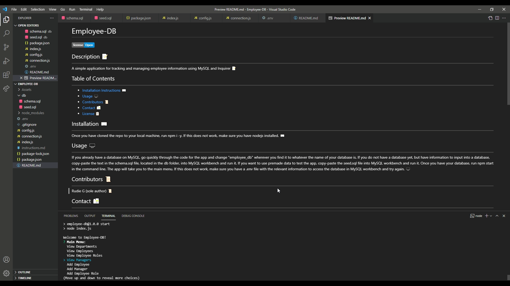

# Employee-DB
 

## Description 📝 
---
A simple application for tracking and managing employee information using MySQL and Inquirer 📝

## Table of Contents  
---
- [Installation Instructions ⌨️](#installation-⌨️)
- [Usage 🖥️](#usage-🖥️)
- [Contributors 📜](#contributors-📜)
- [Contact 📠](#contact-📠)
- [License 📋](#license-📋)

## Installation ⌨️ 
---
Once you have cloned the repo to your local machine, run npm i -y. If this does not work, make sure you have nodejs installed. ⌨️
  
## Usage 🖥️ 
---
If you already have a database on MySQL, go quickly through the code for the app and change "employee_db" wherever you find it to whatever the name of your database is. If you do not have a database yet, but have information to input into a database, copy-paste the text in the schema.sql file, located in the db folder, into MySQL workbench and run it. If you want to use premade data to test the app, copy-paste the seed.sql file into MySQL workbench and run it. Once you have your database, run npm start in the command line. The app will take you to the main menu. If this does not work, make sure you have a .env file with the relevant information to access the database in MySQL workbench and try again. 🖥️

## Screenshot & Video 📸 (click on screenshot to see video)
---

  
## Contributors 📜 
---
Rudie G (sole author) 📜

## Contact 📠 
---
 
GitHub: https://github.com/rudie-g
 
 
Email: rauoldm@gmail.com
 
 

## License 📋

---
 
This application is covered by <a href=""> no</a> license.
